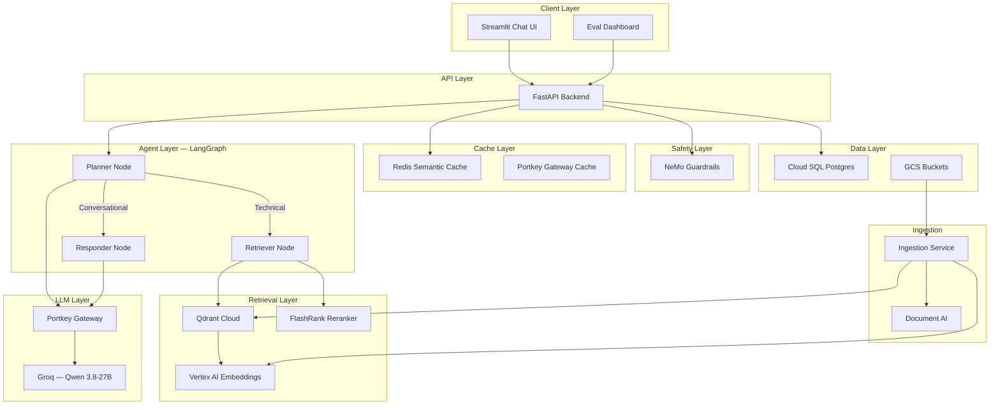

# Enterprise Agentic RAG Platform

> An enterprise-grade **Retrieval-Augmented Generation** system powered by a **LangGraph agentic pipeline**, **NeMo Guardrails**, **Portkey LLM Gateway**, and **RAGAS evaluation** — deployed as four Cloud Run microservices on Google Cloud.

---

## Table of Contents

- [Project Description](#project-description)
- [Key Features](#key-features)
- [Architecture Overview](#architecture-overview)
- [Technology Stack](#technology-stack)
- [Repository Structure](#repository-structure)
- [Prerequisites](#prerequisites)
- [Environment Variables](#environment-variables)
- [Local Development Setup](#local-development-setup)
- [Running the Project Locally](#running-the-project-locally)
- [Document Ingestion](#document-ingestion)
- [API Documentation](#api-documentation)
- [Docker Setup](#docker-setup)
- [Database Setup](#database-setup)
- [RAG/AI Pipeline](#ragai-pipeline)
- [Evaluation Suite](#evaluation-suite)
- [Cloud Architecture](#cloud-architecture)
- [Infrastructure / Terraform Setup](#infrastructure--terraform-setup)
- [Deployment Instructions](#deployment-instructions)
- [CI/CD Pipeline](#cicd-pipeline)
- [Monitoring & Observability](#monitoring--observability)
- [Security Considerations](#security-considerations)
- [Troubleshooting](#troubleshooting)
- [Development Workflow](#development-workflow)
- [Testing Strategy](#testing-strategy)
- [Production Checklist](#production-checklist)
- [Future Improvements](#future-improvements)
- [Contributing](#contributing)
- [License](#license)

---

## Project Description

Enterprise Agentic RAG is an intelligent document QA system designed for enterprise IT knowledge bases. It ingests multi-format documents (PDF, HTML, DOCX, PPTX, TXT), indexes them into a Qdrant vector database using Vertex AI embeddings, and answers technical questions through a multi-stage agentic pipeline.

The system uses:

- **LangGraph** for agentic orchestration (Planner → Retriever → Responder)
- **NeMo Guardrails** for input safety (jailbreak protection, off-topic filtering)
- **Portkey Gateway** for LLM routing (retry, fallback, caching, observability)
- **FlashRank** for fast local cross-encoder reranking
- **Redis Memorystore** for semantic query caching
- **Cloud SQL PostgreSQL** for persistent conversation memory
- **RAGAS** for automated RAG quality evaluation (6 metrics)

---

## Key Features

| Feature | Description |
|---------|-------------|
| 🤖 **Agentic RAG Pipeline** | LangGraph state graph with Planner (intent routing), Retriever (search + rerank), and Responder (LLM synthesis) |
| 🛡️ **NeMo Guardrails** | Colang-based rules for jailbreak detection, off-topic blocking, and conversation control |
| 🔀 **LLM Gateway** | Portkey proxy with automatic retry (2x), fallback (primary → secondary Groq key), and semantic caching |
| ⚡ **Semantic Cache** | Redis-based embedding similarity cache to serve repeated queries instantly |
| 🧠 **Conversation Memory** | PostgreSQL-backed checkpointing (prod) / in-memory (dev) for multi-turn conversations |
| 📄 **Multi-Format Ingestion** | PDF (via Document AI), HTML (BeautifulSoup), DOCX/PPTX (Unstructured), TXT — CLI or Eventarc webhook |
| 🔍 **Hybrid Retrieval** | Qdrant vector search (top-15) → FlashRank cross-encoder reranking (top-5) |
| 🧪 **RAGAS Evaluation** | 6 metrics: Faithfulness, Answer Relevancy, Context Precision, Context Recall, Answer Correctness, Tool Correctness |
| 📊 **Eval Dashboard** | Streamlit UI with golden dataset, live pipeline, metric scoring, history tracking |
| ☁️ **Cloud-Native** | 4 Cloud Run microservices, Terraform IaC, Eventarc triggers, Secret Manager |

---

## Architecture Overview



### Request Lifecycle

```
User Query → Guardrails Gate → Semantic Cache Check → Planner (intent classification)
  ├─ Conversational → Responder (uses conversation memory)
  └─ Technical → Retriever (Qdrant search → FlashRank rerank) → Responder (LLM synthesis)
       └─ Store in cache → Return answer + sources + thought process
```

---

## Technology Stack

| Layer | Technology |
|-------|-----------|
| **Backend** | Python 3.11, FastAPI, Uvicorn |
| **Agent Framework** | LangGraph (StateGraph), LangChain |
| **LLM** | Groq (Qwen 3.8-27B) via Portkey Gateway |
| **Embeddings** | Vertex AI text-embedding-004 (768 dims) |
| **Vector DB** | Qdrant Cloud (Cosine distance) |
| **Reranker** | FlashRank (MiniLM-L-6-v2 ONNX) |
| **Guardrails** | NVIDIA NeMo Guardrails (Colang 1.0) |
| **Cache** | Redis Memorystore (semantic similarity) |
| **Database** | Cloud SQL PostgreSQL 15 |
| **UI** | Streamlit |
| **Observability** | Pydantic Logfire, LangSmith |
| **Infrastructure** | Terraform, Cloud Run, Eventarc |
| **CI/CD** | Google Cloud Build |
| **Document Parsing** | Google Document AI, BeautifulSoup, Unstructured |

---

## Repository Structure

```
├── app/                          # FastAPI backend application
│   ├── main.py                   # API entry point (/query, /graph)
│   ├── config.py                 # Settings from environment variables
│   ├── agents/                   # LangGraph agent pipeline
│   │   ├── graph.py              # State graph: Planner → Retriever → Responder
│   │   ├── state.py              # AgentState TypedDict
│   │   └── nodes/                # Pipeline nodes
│   │       ├── planner.py        # Intent classification
│   │       ├── retriever.py      # Vector search + reranking
│   │       └── responder.py      # LLM answer synthesis
│   ├── gateway/                  # Portkey LLM Gateway integration
│   ├── guardrails/               # NeMo Guardrails (Colang rules)
│   ├── ingestion/                # Document ingestion pipeline
│   │   ├── processor.py          # CLI + Eventarc webhook modes
│   │   ├── chunking/             # Text chunking
│   │   └── loaders/              # PDF, HTML, DOCX, TXT parsers
│   └── services/                 # External service integrations
│       ├── gcp/                  # Cloud SQL, Redis
│       └── retrieval/            # Qdrant, embeddings, FlashRank
├── ui/                           # Streamlit chat interface
├── evals/                        # RAGAS evaluation suite
│   ├── app.py                    # Streamlit eval dashboard
│   ├── pipeline.py               # Live pipeline runner
│   ├── metrics.py                # 6 RAGAS metrics
│   ├── guardrails_eval.py        # Guardrails TP/TN/FP/FN eval
│   ├── store.py                  # GCS persistence
│   └── golden_dataset.json       # Ground truth Q&A pairs
├── terraform/                    # Infrastructure as Code
├── docker/                       # Per-service Dockerfiles
├── cloudbuild.yaml               # Cloud Build configuration
├── requirements*.txt             # Per-service dependency files
└── pyproject.toml                # Project metadata
```

---

## Prerequisites

| Tool | Version | Purpose |
|------|---------|---------|
| Python | >= 3.11 | Runtime |
| Google Cloud SDK | Latest | GCP authentication, CLI |
| Terraform | >= 1.5 | Infrastructure provisioning |
| Docker | Latest | Container builds (optional for local) |
| Redis | >= 7.0 | Semantic cache (optional for local) |

### Required API Keys

| Service | Where to Get |
|---------|-------------|
| Groq API Key | [console.groq.com](https://console.groq.com) |
| Qdrant Cloud | [cloud.qdrant.io](https://cloud.qdrant.io) |
| Portkey | [app.portkey.ai](https://app.portkey.ai) |
| Logfire | [logfire.pydantic.dev](https://logfire.pydantic.dev) |
| LangSmith | [smith.langchain.com](https://smith.langchain.com) |

---

## Environment Variables

| Variable | Required | Description | Default |
|----------|----------|-------------|---------|
| `GROQ_API_KEY` | Yes | Primary Groq API key | — |
| `GROQ_FALLBACK_API_KEY` | No | Fallback Groq key (Portkey failover) | — |
| `QDRANT_CLUSTER_ENDPOINT` | Yes | Qdrant Cloud cluster URL | — |
| `QDRANT_API_KEY` | Yes | Qdrant Cloud API key | — |
| `PORTKEY_API_KEY` | Yes | Portkey gateway API key | — |
| `PORTKEY_CONFIG_ID` | Yes | Portkey config slug | — |
| `LOGFIRE_TOKEN` | Yes | Pydantic Logfire token | — |
| `LANGSMITH_API_KEY` | No | LangSmith tracing key | — |
| `LANGSMITH_PROJECT` | No | LangSmith project name | `enterprise-rag` |
| `PROJECT_ID` | Yes | GCP project ID | `enterprise-rag-509108` |
| `LOCATION` | No | GCP region | `us-central1` |
| `GCP_DOC_AI_PROCESSOR_ID` | Yes* | Document AI processor ID (*ingestion only) | — |
| `LOCAL_MODE` | No | Use MemorySaver instead of PostgreSQL | `true` |
| `USE_SEMANTIC_CACHE` | No | Enable Redis semantic cache | `false` |
| `REDIS_HOST` | No | Redis host IP | `127.0.0.1` |
| `BACKEND_URL` | No | Backend API URL (for UI/evals) | `http://localhost:8000` |
| `JUDGE_GROQ` | No | Separate Groq key for evals | — |

---

## Local Development Setup

```bash
# 1. Clone the repository
git clone https://github.com/abhip161/Enterprise-Agentic-RAG-Platform.git
cd Enterprise-Agentic-RAG

# 2. Create and activate virtual environment
python -m venv .venv
# Windows:
.venv\Scripts\activate
# Linux/macOS:
# source .venv/bin/activate

# 3. Install dependencies
pip install -r requirements.txt

# 4. Create your .env file
# Create a .env file with required environment variables (see table above)
# Set LOCAL_MODE=true and USE_SEMANTIC_CACHE=false for local development

# 5. Authenticate with GCP (for Vertex AI embeddings)
gcloud auth application-default login
gcloud config set project YOUR_PROJECT_ID

# 6. Verify
python -c "from app.config import settings; print(settings.PROJECT_ID)"
```

---

## Running the Project Locally

### Backend API

```bash
uvicorn app.main:app --reload --port 8000
# API:    http://localhost:8000
# Docs:   http://localhost:8000/docs
```

### Chat UI

```bash
# In a separate terminal:
streamlit run ui/app.py
# UI:     http://localhost:8501
```

### Evaluation Dashboard

```bash
# Requires backend to be running on :8000
streamlit run evals/app.py
```

---

## Document Ingestion

### CLI Mode (Local)

```bash
# Ingest all documents from DATA/ directory:
python -m app.ingestion.processor DATA/

# Wipe existing Qdrant collection and re-ingest:
python -m app.ingestion.processor DATA/ --wipe

# Ingest from a specific directory:
python -m app.ingestion.processor DATA/true_data
```

### Cloud Mode (Eventarc)

In production, uploading a file to the GCS raw bucket triggers an Eventarc webhook that invokes the ingestion Cloud Run service at `/ingest`. No manual action required.

```bash
# Upload triggers automatic ingestion:
gsutil cp my_document.pdf gs://YOUR_PROJECT_ID-rag-raw/true/
```

### Supported Formats

| Format | Parser | Notes |
|--------|--------|-------|
| PDF | Google Document AI | Auto-splits PDFs >15 pages |
| HTML | BeautifulSoup | Strips scripts/styles |
| DOCX | Unstructured | Via python-docx |
| PPTX | Unstructured | Via python-pptx |
| TXT | Built-in | UTF-8 with error ignore |

---

## API Documentation

### `GET /`

Health check — returns `{"message": "Enterprise Agentic RAG API is running"}`.

### `POST /query`

Execute the RAG pipeline.

**Request:**
```json
{
  "q": "How does Kubernetes HPA work?",
  "thread_id": "optional-session-id"
}
```

**Response:**
```json
{
  "question": "How does Kubernetes HPA work?",
  "answer": "Kubernetes HPA (Horizontal Pod Autoscaler) automatically scales...",
  "thought_process": [
    "Intent: Technical",
    "Search Term: Kubernetes HPA autoscaling",
    "Context Retrieved"
  ],
  "status": "Response generated.",
  "sources": ["CONTENT: The HPA controller periodically..."]
}
```

### `GET /graph`

Returns a PNG image of the LangGraph workflow diagram.

---

## Docker Setup

Four Dockerfiles in `docker/`:

```bash
# Build backend
docker build -f docker/backend.Dockerfile -t rag-backend .

# Build UI
docker build -f docker/ui.Dockerfile -t rag-ui .

# Build ingestion
docker build -f docker/ingestion.Dockerfile -t rag-ingestion .

# Build evals
docker build -f docker/evals.Dockerfile -t rag-evals .

# Run backend
docker run -p 8080:8080 --env-file .env rag-backend

# Run UI
docker run -p 8501:8501 -e BACKEND_URL=http://host.docker.internal:8080 rag-ui
```

---

## Database Setup

### Local Development

Set `LOCAL_MODE=true` in `.env`. The backend uses in-memory `MemorySaver` — no database required.

### Production (Cloud SQL)

Cloud SQL PostgreSQL 15 is provisioned via Terraform. The backend connects via Cloud SQL Auth Proxy using a Unix socket:

```
DB_HOST=/cloudsql/PROJECT:REGION:INSTANCE
DB_NAME=enterprise_rag
DB_USER=rag_admin
DB_PASSWORD=<from Secret Manager>
```

---

## RAG/AI Pipeline

### Intent Classification (Planner)

The Planner node uses an LLM to classify user messages:
- **CONVERSATIONAL**: Greetings, follow-ups, conversation references — skip retrieval
- **Technical query**: Generates an optimized search query — route to Retriever

### Retrieval + Reranking

1. **Vertex AI Embedding**: Query → 768-dim vector
2. **Qdrant Search**: Top-15 results by cosine similarity
3. **FlashRank Reranking**: Cross-encoder rescoring → top-5 most relevant

### Response Generation

The Responder uses the Portkey gateway to call Groq's Qwen 3.8-27B with:
- Retrieved document context (max 25K chars)
- Conversation history (for multi-turn coherence)
- Role-specific prompt (Senior Technical Architect)

---

## Evaluation Suite

The evaluation suite in `evals/` provides systematic RAG quality measurement:

### Golden Dataset

`golden_dataset.json` contains ground-truth Q&A pairs and guardrails test cases built from actual enterprise documents.

### Metrics (6 Experiments)

| Metric | Type | What It Measures |
|--------|------|-----------------|
| Faithfulness | LLM-judged | Is the answer grounded in retrieved context? |
| Answer Relevancy | LLM-judged | Does the answer address the question? |
| Context Precision | LLM-judged | Are retrieved contexts relevant to the question? |
| Context Recall | LLM-judged | Do retrieved contexts cover the reference answer? |
| Answer Correctness | LLM-judged | Does the answer match the reference? |
| Tool Correctness | Deterministic | Did the agent call the right tool? |

### Running Evals

```bash
# 1. Start the backend
uvicorn app.main:app --port 8000

# 2. Launch the eval dashboard
streamlit run evals/app.py

# 3. Step 1: Review golden dataset
# 4. Step 2: Run live pipeline (calls /query for each sample)
# 5. Step 3: Run RAGAS metrics (~50 min due to rate limits)
```

---

## Cloud Architecture

| Service | Cloud Run Name | Purpose | Scaling | Ingress |
|---------|---------------|---------|---------|---------|
| Backend | `enterprise-rag-backend` | FastAPI + LangGraph agent | 1-10 instances | Public |
| UI | `enterprise-rag-ui` | Streamlit chat interface | 0-5 instances | Public |
| Ingestion | `enterprise-rag-ingestion` | Eventarc webhook processor | 0-5 instances | Internal only |
| Evals | `enterprise-rag-evals` | RAGAS evaluation dashboard | 0-3 instances | Public |

### Supporting Services

| Service | Type | Purpose |
|---------|------|---------|
| Cloud SQL | PostgreSQL 15 | Conversation memory (LangGraph checkpointer) |
| Redis Memorystore | Redis 7.0 | Semantic query cache |
| GCS (raw) | Storage bucket | Uploaded documents |
| GCS (processed) | Storage bucket | Processed metadata + eval results |
| Secret Manager | Secrets | 9 API keys and tokens |
| Eventarc | Event trigger | GCS upload → ingestion webhook |
| Artifact Registry | Docker registry | Container images |

---

## Infrastructure / Terraform Setup

All infrastructure is defined in `terraform/`:

```bash
cd terraform

# 1. Initialize
terraform init

# 2. Configure variables
cp terraform.tfvars.example terraform.tfvars
# Edit terraform.tfvars with your values

# 3. Plan
terraform plan -out=tfplan

# 4. Apply
terraform apply tfplan

# 5. View outputs
terraform output
```

### Terraform Files

| File | Resources |
|------|-----------|
| `provider.tf` | Google + Google-Beta providers |
| `main.tf` | VPC, GCS buckets, Redis, Artifact Registry, API enablement |
| `cloud_run.tf` | 4 Cloud Run services with Secret Manager integration |
| `database.tf` | Cloud SQL PostgreSQL instance, database, user |
| `ingestion.tf` | Eventarc trigger, ingestion service account, IAM |
| `secrets.tf` | Secret Manager data sources, IAM bindings |
| `variables.tf` | Input variables (secrets marked sensitive) |
| `output.tf` | Service URLs, Redis IP, SQL connection name |

---

## Deployment Instructions

### Build and Push Images

```bash
# Via Cloud Build (recommended):
gcloud builds submit --config cloudbuild.yaml --substitutions=_TAG=v1.0.0 .

# Or locally:
docker build -f docker/backend.Dockerfile -t us-central1-docker.pkg.dev/PROJECT/enterprise-rag-repo/backend:v1.0.0 .
docker push us-central1-docker.pkg.dev/PROJECT/enterprise-rag-repo/backend:v1.0.0
```

### Deploy Infrastructure

```bash
cd terraform
terraform plan -out=tfplan
terraform apply tfplan
```

### Verify Deployment

```bash
# Get service URLs
terraform output

# Health check
curl $(terraform output -raw backend_url)/

# Test query
curl -X POST $(terraform output -raw backend_url)/query \
  -H "Content-Type: application/json" \
  -d '{"q": "What is Kubernetes HPA?"}'
```

---

## CI/CD Pipeline

The project uses Google Cloud Build (`cloudbuild.yaml`):

| Step | Description |
|------|-------------|
| `build-backend` | Builds backend Docker image |
| `build-ui` | Builds UI Docker image |
| `build-ingestion` | Builds ingestion Docker image |
| `build-evals` | Builds evals Docker image |

All 4 builds run in **parallel** for speed. Images are pushed to Artifact Registry with both `_TAG` and `latest` tags.

```bash
# Trigger manually:
gcloud builds submit --config cloudbuild.yaml --substitutions=_TAG=v1.0.0 .

# With git SHA tag:
gcloud builds submit --config cloudbuild.yaml --substitutions=_TAG=$(git rev-parse --short HEAD) .
```

> **Note**: Deployment to Cloud Run is not automated. After building, run `terraform apply` to update the services.

---

## Monitoring & Observability

| Tool | Purpose | Dashboard |
|------|---------|-----------|
| **Pydantic Logfire** | Distributed tracing, request spans | [logfire.pydantic.dev](https://logfire.pydantic.dev) |
| **LangSmith** | LangChain/LangGraph trace inspection | [smith.langchain.com](https://smith.langchain.com) |
| **Portkey** | LLM call analytics, cost tracking, cache stats | [app.portkey.ai](https://app.portkey.ai) |
| **Cloud Run Metrics** | Instance count, latency, CPU/memory | GCP Console |

---

## Security Considerations

- **API Keys**: Stored in GCP Secret Manager for production. Never commit `.env` or `terraform.tfvars`.
- **Network**: Ingestion service uses internal-only ingress. Backend uses VPC egress for Redis/SQL.
- **Guardrails**: NeMo Guardrails block jailbreak attempts and off-topic queries.
- **Database**: Cloud SQL accessed via Auth Proxy (Unix socket), no public TCP.
- **Container Secrets**: Injected at runtime from Secret Manager, not baked into images.

---

## Troubleshooting

### Common Errors

| Error | Cause | Fix |
|-------|-------|-----|
| `LOGFIRE_TOKEN is empty or None` | Missing token in `.env` | Set `LOGFIRE_TOKEN` |
| `Qdrant Search Failed` | Invalid Qdrant credentials or network | Verify `QDRANT_CLUSTER_ENDPOINT` and `QDRANT_API_KEY` |
| `Document AI Parse Failed` | Wrong processor ID or API not enabled | Check `GCP_DOC_AI_PROCESSOR_ID`, enable Document AI API |
| `Redis connection failed` | Redis not running locally | Start Redis or set `USE_SEMANTIC_CACHE=false` |
| `DB pool unavailable` | Missing DB credentials | Set `LOCAL_MODE=true` for local dev |
| `Cannot reach FastAPI` (evals) | Backend not running | Start backend on port 8000 first |
| `429 rate limit` | Groq TPM/RPM exceeded | Wait for cooldown; Portkey auto-retries |

### Debugging

```bash
# View Cloud Run logs:
gcloud run services logs read enterprise-rag-backend --region=us-central1

# Check Logfire traces:
# Visit https://logfire.pydantic.dev and select your project

# Test Qdrant connectivity:
python -c "from app.services.retrieval.qdrant_service import client; print(client.get_collections())"
```

---

## Development Workflow

1. Create a feature branch from `main`
2. Implement changes following existing code patterns
3. Test locally with `uvicorn app.main:app --reload`
4. Run the eval suite to verify RAG quality hasn't regressed
5. Open a PR to the `prod` branch
6. Build images via Cloud Build
7. Deploy via `terraform apply`

---

## Testing Strategy

| Type | Tool | Status | Location |
|------|------|--------|----------|
| **RAG Evaluation** | RAGAS + custom metrics | Implemented | `evals/` |
| **Guardrails Eval** | Binary TP/TN/FP/FN | Implemented | `evals/guardrails_eval.py` |
| **Unit Tests** | pytest | Not yet implemented | — |
| **Integration Tests** | pytest | Not yet implemented | — |
| **E2E Tests** | pytest + requests | Not yet implemented | — |

---

## Production Checklist

- [ ] Rotate all API keys (if previously exposed)
- [ ] Add API authentication to backend
- [ ] Add rate limiting
- [ ] Add input validation (query length limits)
- [ ] Set `deletion_protection = true` on Cloud SQL
- [ ] Set `force_destroy = false` on GCS buckets
- [ ] Upgrade Cloud SQL from `db-f1-micro`
- [ ] Configure Terraform remote backend (GCS)
- [ ] Add health check endpoint
- [ ] Add unit and integration tests
- [ ] Add linting/formatting to CI pipeline
- [ ] Add dependency and container scanning
- [ ] Add non-root user to Dockerfiles
- [ ] Restrict Evals dashboard access
- [ ] Set up alerting on error rates and latency

---

## Future Improvements

- [ ] API authentication (Bearer token or GCP IAM)
- [ ] Rate limiting (per-IP and per-tenant)
- [ ] Multi-tenant support with tenant-scoped collections
- [ ] Chunk overlap in text splitter
- [ ] Relevance score threshold for retrieval
- [ ] Empty retrieval handling (prevent hallucination)
- [ ] Output validation (hallucination detection)
- [ ] Source citations in LLM responses
- [ ] Redis Vector Search for O(1) cache lookups
- [ ] Document deduplication in ingestion
- [ ] Comprehensive test suite (unit + integration + E2E)
- [ ] CI/CD with automated deployment and rollback
- [ ] Environment separation (dev/staging/prod)
- [ ] Cloud Armor WAF
- [ ] Custom observability metrics and dashboards

---

## Contributing

1. Fork the repository
2. Create a feature branch (`git checkout -b feature/my-feature`)
3. Commit changes (`git commit -m 'feat: add my feature'`)
4. Push to your branch (`git push origin feature/my-feature`)
5. Open a Pull Request

Please follow:
- [Conventional Commits](https://www.conventionalcommits.org/) for commit messages
- Existing code patterns and file organization
- Add tests for new functionality (when test framework is set up)

---

## License

This project is proprietary. All rights reserved.
